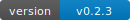

# PTO Track - Resource Scheduling Calendar


[](https://ado.corp.asbhawaii.com/ASB/ASB%20Dev%20Team/_build/latest?definitionId=148&branchName=main)

A comprehensive ASP.NET Core resource scheduling and PTO (Paid Time Off) tracking application built with clean architecture principles. Features an interactive scheduler interface powered by DayPilot for managing employee absences and time-off requests.

## Features

### 🗓️ Absence Scheduler

The application features a comprehensive **Absence Scheduler** (`/AbsencesScheduler`) for managing employee time-off requests:

- **Interactive Timeline**: Visual timeline view of all employee absences
- **Request Management**: Drag-and-drop interface for creating new absence requests
- **Approval Workflow**: Built-in workflow with four states: Pending, Approved, Rejected, Cancelled
- **Role-Based Access**:
  - **Employees**: View team availability and manage their own requests
  - **Managers/Approvers**: Review and approve/reject requests
  - **Admins**: Full system oversight
- **Real-time Updates**: Immediate feedback on request status changes

The system is built with clean architecture principles and provides a seamless user experience for both employees and managers.

## Architecture Overview

This solution implements a clean, layered architecture with clear separation of concerns:

```
pto.track              → Web layer (UI + API Controllers)
pto.track.services     → Business logic layer (Services + DTOs)
pto.track.data         → Data access layer (EF Core + Entities)
```

### Project Structure

#### **pto.track** (Main Web Application)
- **Technology**: ASP.NET Core 10.0 Razor Pages + Web API
- **Purpose**: Frontend UI and RESTful API endpoints
- **Key Components**:
  - `Controllers/EventsController.cs` - Event CRUD operations API
  - `Controllers/ResourcesController.cs` - Resource management API
  - `Controllers/AbsenceController.cs` - Absence request approval workflow API
  - `Pages/Index.cshtml` - Landing page with navigation
  - `Pages/AbsencesScheduler.cshtml` - Main absence management interface (Scheduler view)
  - `Pages/Scheduling.cshtml` - Legacy resource scheduling view
  - `Pages/Absences.cshtml` - Legacy absence list view
  # PTO Track (PTO Tracker)

  PTO Track is an ASP.NET Core 9 web application that provides resource scheduling and paid-time-off (PTO) tracking. It combines Razor Pages server-rendered UI with modular client-side ES modules (bundled into fingerprinted assets) and a service layer for business logic.

  This README is a concise developer-oriented reference: quickstart steps, available tasks, test & analyzer guidance, and pointers to important artifacts and docs in the repository.

  **Status:** active development (see `feature/add-local-env` branch for recent infra/workflow updates)

  ---

  ## Quick Start (developer)

  **Prerequisites**

  - .NET 9 SDK
  - Node.js & npm (optional — only needed to build frontend assets locally)
  - PowerShell (`pwsh`) for local helper scripts

  **Clone and build**

  ```pwsh
  git clone <repo-url>
  cd pto
  dotnet build
  ```

  **Run locally (development)**

  ```pwsh
  # run the web app (uses appsettings.Development.json)
  dotnet run --project pto.track/pto.track.csproj
  ```

  Open `https://localhost:5001` (or the URL printed by the run output).

  **Frontend assets**

  If you need to rebuild the frontend bundles (TypeScript → ESM), run the frontend build scripts (requires Node/npm):

  ```pwsh
  cd pto.track
  npm ci
  npm run build
  ```

  Runtime uses `wwwroot/dist/asset-manifest.json` to load fingerprinted bundles; see `pto.track/scripts/update-fixtures-from-manifest.js` for fixture sync tooling used in tests.

  ---

  ## Tests, analyzers & metrics

  **Run the full C# test suite**

  ```pwsh
  dotnet test pto.track.tests/pto.track.tests.csproj -c Release
  ```

  **Run analyzers separately** (we keep analyzers separate from functional tests)

  ```pwsh
  # helper script that runs analyzers and writes SARIF + logs
  pwsh .\scripts\run-analyzers.ps1
  ```

  **Metrics**

  - A test-based metrics harness (`pto.track.tests` / `CodeMetricsAnalyzer`) writes machine-readable metrics to `artifacts/metrics/`:
    - `artifacts/metrics/code-metrics.json` — detailed per-project metrics
    - `artifacts/metrics/code-metrics-summary.json` — compact KPI summary

  **Analyzer artifacts**

  - Analyzer logs and SARIF are written to `artifacts/analyzers/` by the analyzer runner. The runner writes a SARIF skeleton when MSBuild produces none so CI consumers always have a SARIF artifact to upload.

  Quick local runs and tips:

  - To speed up local iteration **skip the code-metrics harness** (it performs Roslyn parsing across the repo and can be slow):

  ```pwsh
  $env:SKIP_CODE_METRICS='1'
  $env:ASPNETCORE_ENVIRONMENT='Testing'
  dotnet test .\pto.track.sln
  ```

  - Frontend tests live in `pto.track.tests.js` — run `npm ci` and `npm test` inside that folder to run Jest tests and ESLint validation.

  ---

  ## Useful developer scripts

  - `scripts/dev.ps1` — local dev helper to run common flows
  - `scripts/run-analyzers.ps1` — separate analyzer runner that produces deterministic SARIF and analyzer logs
  - `pto.track/scripts/update-fixtures-from-manifest.js` — rewrites headless/test fixtures to reference hashed frontend assets

  ---

  ## Project layout (high level)

  - `pto.track/` — ASP.NET Core Razor Pages app + controllers + frontend assets
  - `pto.track.services/` — business logic services, DTOs, and unit tests
  - `pto.track.data/` — EF Core DbContext, entities, and migrations
  - `pto.track.tests/` — integration tests + code metrics harness
  - `pto.track.tests.js/` — frontend unit tests / headless fixtures

  See the `docs/` folder for runbooks: `docs/run/RUN-LOCAL.md`, `docs/run/RUN-CI.md`, and `docs/run/TESTING.md`.

  ---

  ## CI notes

  - The repository keeps analyzers and metrics as separate CI artifacts; analyzers publish to `artifacts/analyzers/` and metrics to `artifacts/metrics/`.
  - We intentionally do not fail the main test job on analyzer warnings; instead analyzers run in their own pipeline stage so their SARIF and logs can be inspected independently. See `docs/run/RUN-CI.md` for example pipeline snippets.

  ### Azure DevOps Server Build Badge

  Replace the placeholders in the badge above with your Azure DevOps Server values:

  - `ADO_SERVER`: base URL of your DevOps Server (e.g., `https://devops.contoso.local/tfs`)
  - `COLLECTION`: the collection name (for Server/TFS deployments)
  - `PROJECT`: the project name
  - `PIPELINE_NAME`: the pipeline name as shown in Pipelines
  - `DEFINITION_ID`: the numeric pipeline definition ID

  You can also copy the exact badge from Azure DevOps Server UI:

  - Pipelines → select your pipeline → More actions (⋯) → Status badge → copy the Markdown snippet.

  ### Version Badge (Corp Git)

  The version badge at the top is a local SVG (in `docs/badges/version.svg`). You can have the pipeline update it to reflect the latest tag on `main` by writing the SVG during the tagging step.

  Example PowerShell snippet to generate the SVG (runs on main only):

  ```powershell
  $tag = $env:VersionTag
  if (-not $tag) { $tag = (git describe --tags --abbrev=0 --match "v*.*.*") }
  $content = @"
  <?xml version="1.0" encoding="UTF-8"?>
  <svg xmlns="http://www.w3.org/2000/svg" width="130" height="20" role="img" aria-label="version: $tag">
    <linearGradient id="s" x2="0" y2="100%">
      <stop offset="0" stop-color="#bbb" stop-opacity=".1"/>
      <stop offset="1" stop-opacity=".1"/>
    </linearGradient>
    <mask id="m"><rect width="130" height="20" rx="3" fill="#fff"/></mask>
    <g mask="url(#m)">
      <rect width="60" height="20" fill="#555"/>
      <rect x="60" width="70" height="20" fill="#007ec6"/>
      <rect width="130" height="20" fill="url(#s)"/>
    </g>
    <g fill="#fff" text-anchor="middle" font-family="Verdana,Geneva,DejaVu Sans,sans-serif" font-size="11">
      <text x="30" y="15">version</text>
      <text x="94" y="15">$tag</text>
    </g>
  </svg>
  "@
  Set-Content -Path "$(Build.SourcesDirectory)/docs/badges/version.svg" -Value $content -Encoding UTF8
  ```

  You can optionally commit this updated badge back to `main` during CI (requires repo Contribute permissions) or host it via a static file server and reference the served URL.

  ---

  ## Contributing

  - Fork/branch/PR workflow. Create feature branches and open PRs against the principal integration branch (e.g., `main` or the active integration branch).
  - Please run the test suite and analyzers locally (see scripts above) before opening PRs.

  ---

  ## License & Third-party

  - Application code: see root `LICENSE` file.
  - Third-party notices: `LicensesThirdParty/nuget.txt` and package metadata.

  ---

  If you want, I can also:
  - commit this README to the `feature/add-local-env` branch and open a PR; or
  - run `dotnet build` and `dotnet test` here to verify — tell me which you'd prefer.
