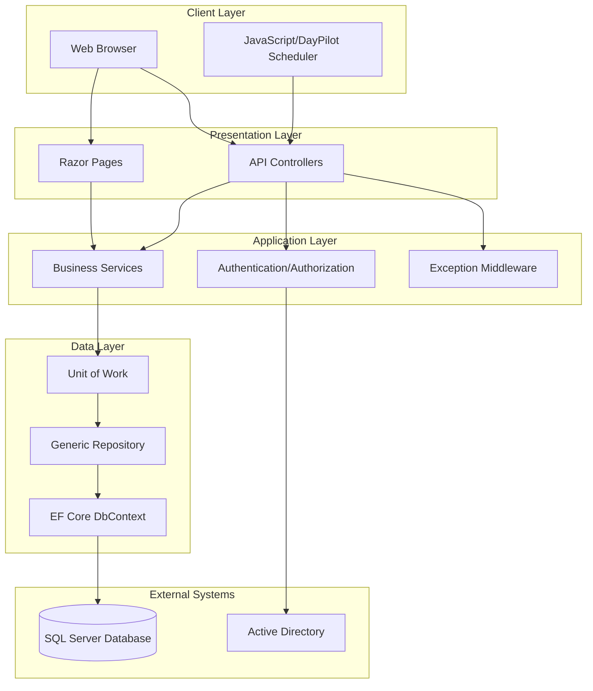
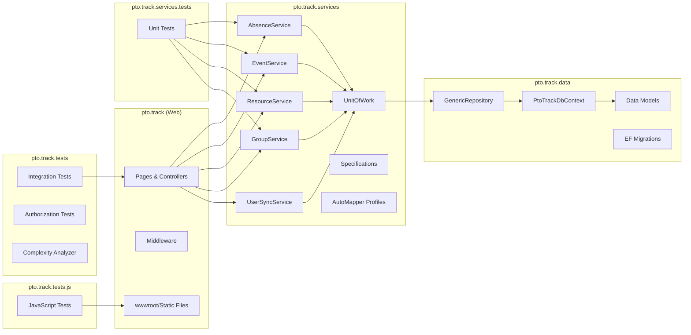
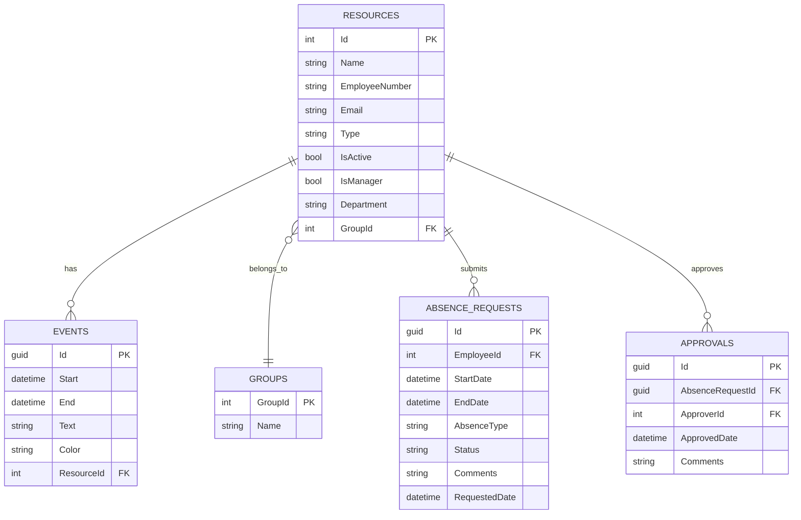
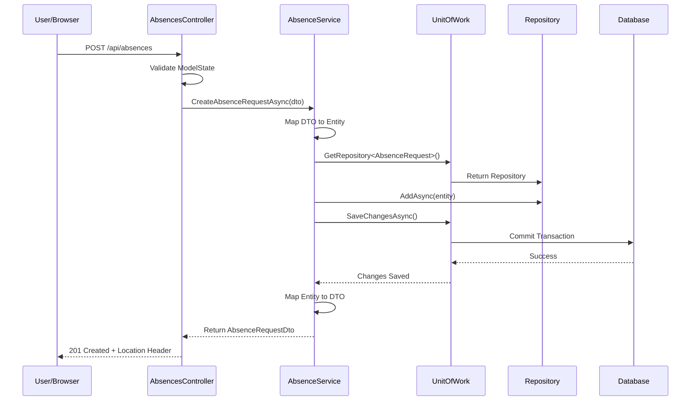
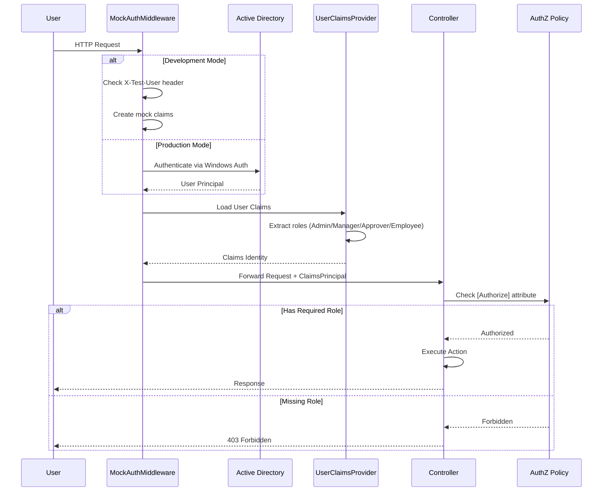
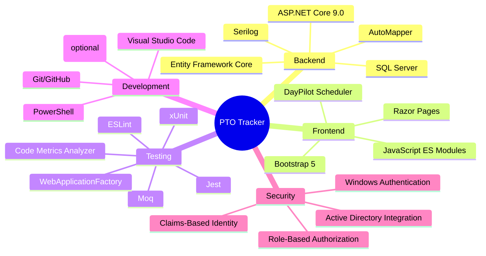
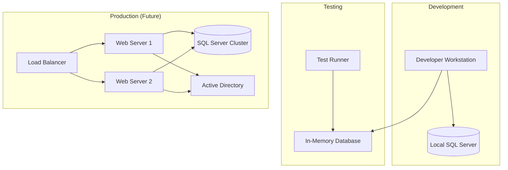
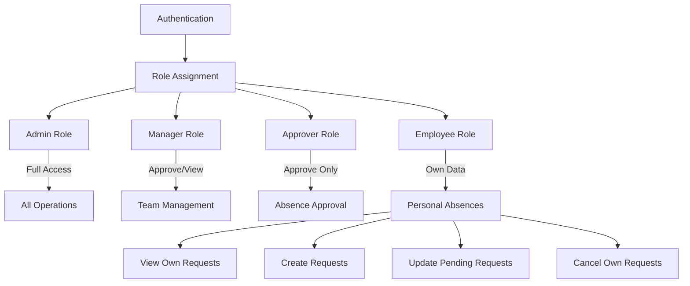

# PTO Tracking Application - Architecture

## System Architecture



## Component Architecture



## Data Model



## Request Flow - Absence Request



## Authentication & Authorization Flow



## Technology Stack



## Deployment Architecture



## Key Design Patterns

### Repository Pattern
- `GenericRepository<T>` provides CRUD operations
- Abstracts data access from business logic
- Enables unit testing with in-memory data

### Unit of Work Pattern
- `UnitOfWork` manages transactions across repositories
- Ensures consistency in multi-step operations
- Coordinates SaveChanges across entities

### Specification Pattern
- `ISpecification<T>` encapsulates query logic
- Reusable, testable query conditions
- Examples: `AbsencesByEmployeeSpecification`, `PendingAbsencesSpecification`

### Service Layer Pattern
- Business logic isolated from controllers
- `IAbsenceService`, `IEventService`, `IResourceService`, `IGroupService`
- Returns `Result<T>` for operation outcomes

### DTO Pattern
- Data Transfer Objects separate API contracts from domain models
- AutoMapper handles entity ↔ DTO conversion
- Examples: `CreateAbsenceRequestDto`, `AbsenceRequestDto`

### Middleware Pattern
- `GlobalExceptionHandler` for centralized error handling
- `MockAuthenticationMiddleware` for development auth simulation
- Custom exception types for domain-specific errors

## Security Model



## API Endpoints

### Absences
- `GET /api/absences?start&end&employeeId&status[]` - Query absences
- `GET /api/absences/pending` - Get pending requests
- `GET /api/absences/{id}` - Get specific absence
- `POST /api/absences` - Create absence request
- `PUT /api/absences/{id}` - Update absence request
- `POST /api/absences/{id}/approve` - Approve request (Manager/Approver)
- `POST /api/absences/{id}/reject` - Reject request (Manager/Approver)
- `POST /api/absences/{id}/cancel` - Cancel request (Employee)
- `DELETE /api/absences/{id}` - Delete absence

### Events (Scheduler)
- `GET /api/events?start&end` - Get events in range
- `GET /api/events/{id}` - Get specific event
- `POST /api/events` - Create event
- `PUT /api/events/{id}` - Update event
- `DELETE /api/events/{id}` - Delete event

### Resources
- `GET /api/resources` - Get all resources
- `GET /api/resources/{id}` - Get specific resource
- `GET /api/resources/group/{groupId}` - Get resources by group

### Groups
- `GET /api/groups` - Get all groups (Admin only)
- `GET /api/groups/{id}` - Get specific group (Admin only)
- `GET /api/groups/{id}/resources` - Get group resources (Admin only)
- `POST /api/groups` - Create group (Admin only)
- `PUT /api/groups/{id}` - Update group (Admin only)
- `DELETE /api/groups/{id}` - Delete group (Admin only)

### Current User
- `GET /api/currentuser` - Get authenticated user info
- `GET /api/currentuser/impersonation-enabled` - Check impersonation status

## Testing Strategy

### Unit Tests (pto.track.services.tests)
- Service layer business logic
- Repository operations
- Mapping configurations
- Specification logic
- 117 tests

### Integration Tests (pto.track.tests)
- End-to-end API workflows
- Authentication/Authorization
- Database interactions
- Exception handling
- 64 tests

### JavaScript Tests (pto.track.tests.js)
- Calendar functions
- Context menu behavior
- Filter logic
- Impersonation UI
- Role detection
- 182 tests

### Code Quality
- Cyclomatic complexity analysis (C# and JavaScript)
- ESLint for JavaScript code quality
- Threshold: Max complexity 10

## Build & Deployment

### Build Process
```bash
dotnet build pto.track.sln
```

### Test Execution
```powershell
.\run-all-tests.ps1
```

### Database Migrations
```bash
dotnet ef migrations add MigrationName --project pto.track.data --startup-project pto.track
dotnet ef database update --project pto.track.data --startup-project pto.track
```

### Run Application
```bash
dotnet run --project pto.track
# or
dotnet watch run --project pto.track
```

## Future Enhancements (See FUTURE.md)
- Email notifications
- Calendar integration (Outlook)
- Mobile responsive design
- Reporting and analytics
- Multi-language support
- Azure deployment
- CI/CD pipeline
