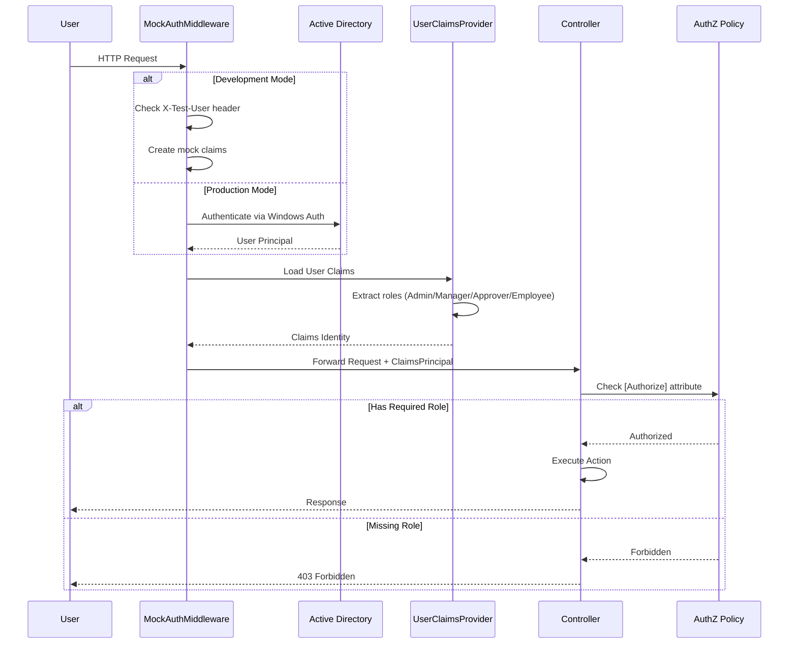

# Authentication & Authorization Flow

This sequence diagram details the security process, including how the Mock Authentication Middleware handles development vs. production modes, and how role-based authorization is enforced.

