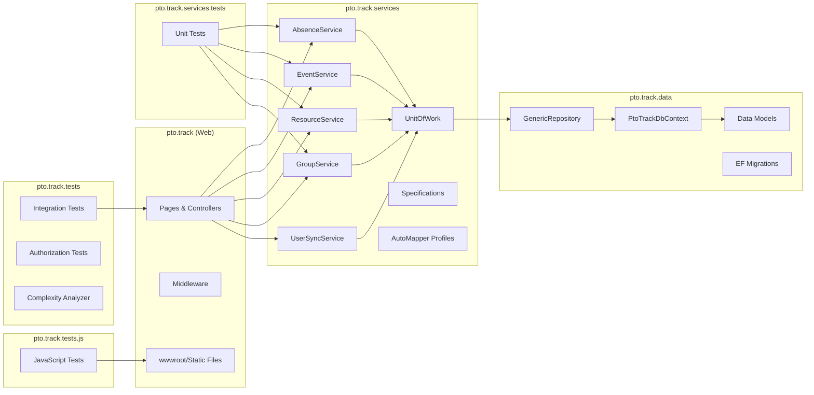

# Component Architecture

This diagram details the internal components of the solution, mapping the dependencies between the web project, services, data access, and test projects.

```mermaid
graph LR
    subgraph "pto.track (Web)"
        PC[Pages & Controllers]
        MW[Middleware]
        WWWROOT[wwwroot/Static Files]
    end

    subgraph "pto.track.services"
        AS[AbsenceService]
        ES[EventService]
        RS[ResourceService]
        GS[GroupService]
        US[UserSyncService]
        UOW[UnitOfWork]
        SPEC[Specifications]
        MAP[AutoMapper Profiles]
    end

    subgraph "pto.track.data"
        CTX[PtoTrackDbContext]
        REPO[GenericRepository]
        MOD[Data Models]
        MIG[EF Migrations]
    end

    subgraph "pto.track.tests"
        INT[Integration Tests]
        AUTH[Authorization Tests]
        METRICS[Complexity Analyzer]
    end

    subgraph "pto.track.services.tests"
        UNIT[Unit Tests]
    end

    subgraph "pto.track.tests.js"
        JSTEST[JavaScript Tests]
    end

    PC --> AS
    PC --> ES
    PC --> RS
    PC --> GS
    PC --> US
    
    AS --> UOW
    ES --> UOW
    RS --> UOW
    GS --> UOW
    US --> UOW
    
    UOW --> REPO
    REPO --> CTX
    CTX --> MOD
    
    INT --> PC
    UNIT --> AS
    UNIT --> ES
    UNIT --> RS
    UNIT --> GS
    JSTEST --> WWWROOT
```
