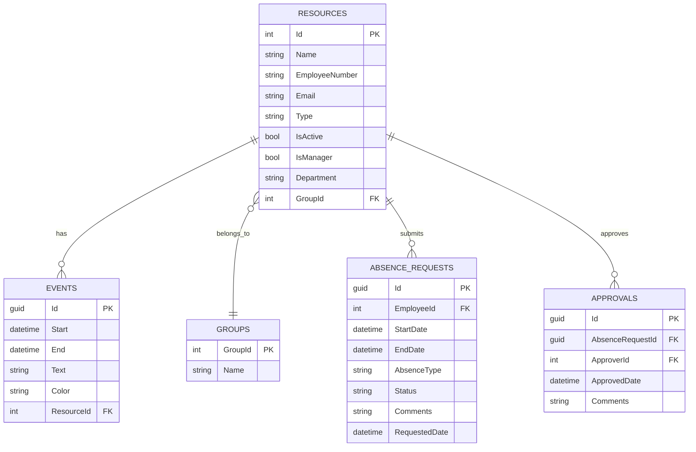

# Data Model

This Entity-Relationship Diagram (ERD) represents the database schema, defining the relationships between Resources, Groups, Events, Absence Requests, and Approvals.

```mermaid
erDiagram
    RESOURCES ||--o{ EVENTS : has
    RESOURCES }o--|| GROUPS : belongs_to
    RESOURCES ||--o{ ABSENCE_REQUESTS : submits
    RESOURCES ||--o{ APPROVALS : approves
    
    RESOURCES {
        int Id PK
        string Name
        string EmployeeNumber
        string Email
        string Type
        bool IsActive
        bool IsManager
        string Department
        int GroupId FK
    }
    
    GROUPS {
        int GroupId PK
        string Name
    }
    
    EVENTS {
        guid Id PK
        datetime Start
        datetime End
        string Text
        string Color
        int ResourceId FK
    }
    
    ABSENCE_REQUESTS {
        guid Id PK
        int EmployeeId FK
        datetime StartDate
        datetime EndDate
        string AbsenceType
        string Status
        string Comments
        datetime RequestedDate
    }
    
    APPROVALS {
        guid Id PK
        guid AbsenceRequestId FK
        int ApproverId FK
        datetime ApprovedDate
        string Comments
    }
```
