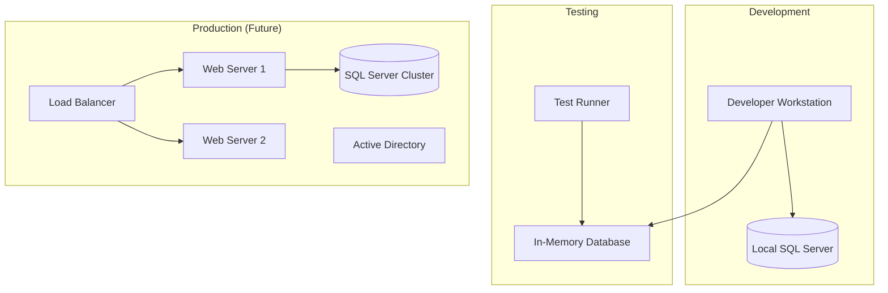

# Deployment Architecture

This diagram outlines the deployment environments, distinguishing between the development workstation setup, the testing environment, and the future production infrastructure.

