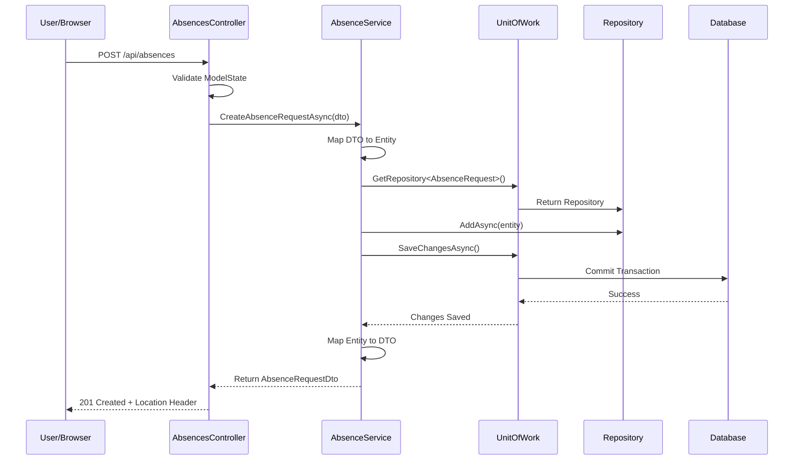

# Request Flow - Absence Request

This sequence diagram illustrates the end-to-end flow of creating an absence request, from the user's browser action through the controller, service, and data layers, and back.

