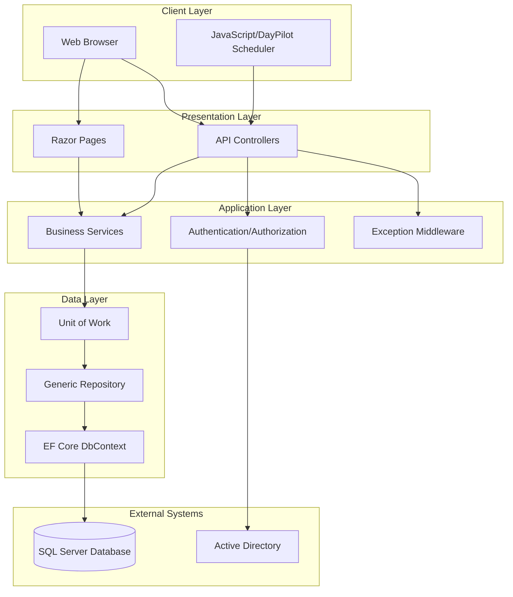

# System Architecture

This diagram illustrates the high-level architecture of the PTO Tracking application, showing the interaction between the client, presentation, application, and data layers, as well as external systems.

