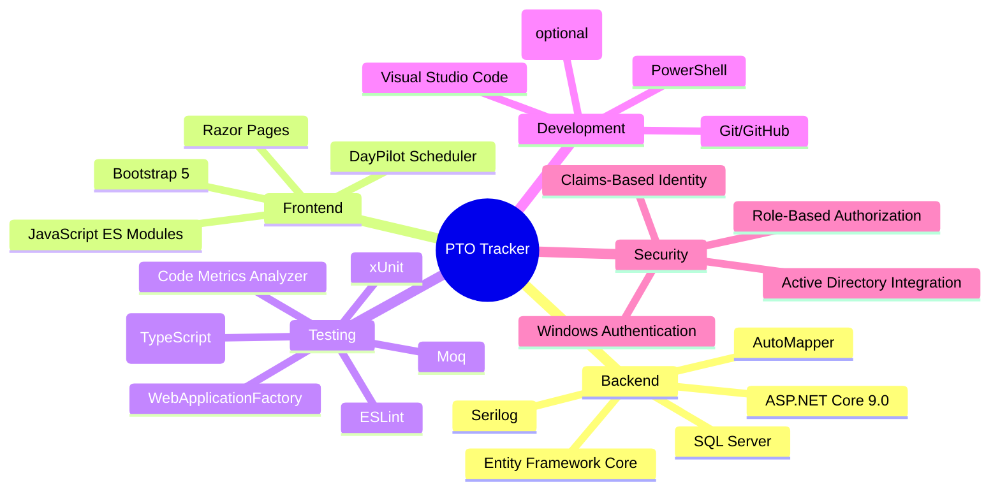

# Technology Stack (summary)

This document lists the primary technologies, frameworks, and tools used to build, test, package, and operate the PTO Tracker application. It's intended as a concise reference for architects, reviewers, and maintainers.

<!-- Diagram: high-level mindmap for quick visual reference -->

## Core technologies

## Frontend runtime & libraries

## Build & bundling

## Code quality, analyzers & metrics

## Testing

## CI / DevOps / Developer tooling

## Observability / diagnostics

## Security & auth

## Tools used in production (concise table)

Below is a text table listing the primary tools, frameworks, and utilities used to build, test, and run this application and notes about their purpose.

| Tool / Technology | Purpose | Notes |
|---|---|---|
| .NET 9 / ASP.NET Core | Application framework / runtime | Backend web API and Razor Pages
| Entity Framework Core | ORM / data access | SQL Server in production; in-memory provider in tests
| SQL Server | Relational database | Production datastore (configurable)
| Serilog | Structured logging | Console/file sinks; configurable via appsettings
| AutoMapper | DTO / domain mapping | Simplifies mapping between DTOs and domain models
| Razor Pages | Server-side UI templates | Page handlers + minimal client hooks
| DayPilot (Lite / Scheduler) | Scheduler UI component | Included in `wwwroot/lib/daypilot`
| Bootstrap 5 | CSS UI framework | Layout and responsive components
| Node.js / npm | Frontend build runtime | Executes `esbuild` and asset manifest generator
| esbuild | TypeScript → ESM bundler | Produces fingerprinted bundles under `wwwroot/dist`
| asset-manifest.json | Asset fingerprint map | Used by runtime manifest-aware loaders and test fixtures
| xUnit | .NET unit & integration tests | Primary test runner for C# tests
| Moq | Mocking library for .NET tests | Used in unit tests
| Microsoft.AspNetCore.Mvc.Testing | WebApplicationFactory integration testing | In-memory server for integration tests
| Jest (TypeScript) | Frontend unit tests | Runs TypeScript/Jest suites under `pto.track.tests.js`
| ESLint | JS/TS linting and complexity rules | Linting included in test pipeline
| Roslyn analyzers / NetAnalyzers | Static analysis | Run via MSBuild; output to logs / SARIF
| SARIF | Analyzer output format | MSBuild `/p:ErrorLog` produces SARIF v2.1.0
| MSBuild binlog / diag | Build diagnostics | For deep troubleshooting of builds/analyzers
| PowerShell (`pwsh`) | Local scripts & developer helper | `scripts/dev.ps1`, `run-analyzers.ps1` etc.
| Git / GitHub | Source control and code review | Branching & PR workflows
| Azure DevOps (pipelines) | CI examples and artifact publishing | See `docs/run/RUN-CI.md` (optional)
| Docker | Optional containerization | Useful for local reproduction/hosting
| Visual Studio Code | Recommended editor | C# extension, Test Explorer, etc.
