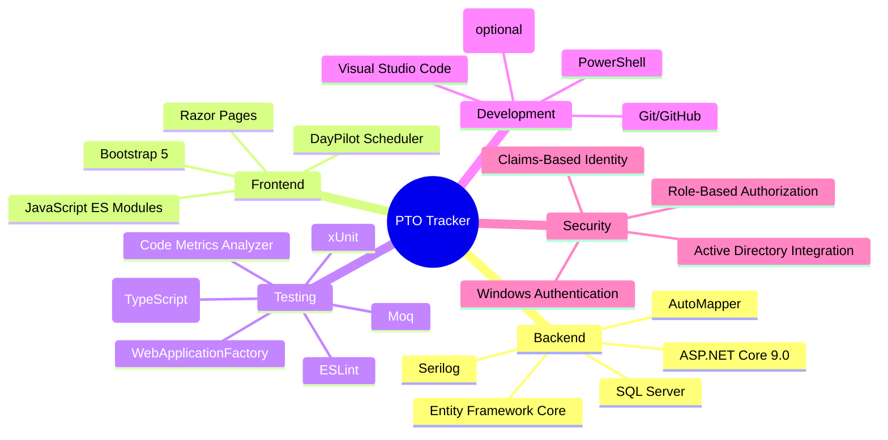

# Technology Stack

This mind map provides an overview of the technologies used across the backend, frontend, testing, development environment, and security layers of the application.

```mermaid
mindmap
    root((PTO Tracker))
        Backend
            ASP.NET Core 9.0
            Entity Framework Core
            SQL Server
            AutoMapper
            Serilog
        Frontend
            Razor Pages
            DayPilot Scheduler
            JavaScript ES Modules
            Bootstrap 5
        Testing
            xUnit
            Jest (TypeScript)
            Moq
            WebApplicationFactory
            ESLint
            Code Metrics Analyzer
        Development
            Visual Studio Code
            Git/GitHub
            PowerShell
            Docker (optional)
        Security
            Windows Authentication
            Active Directory Integration
            Role-Based Authorization
            Claims-Based Identity
```
